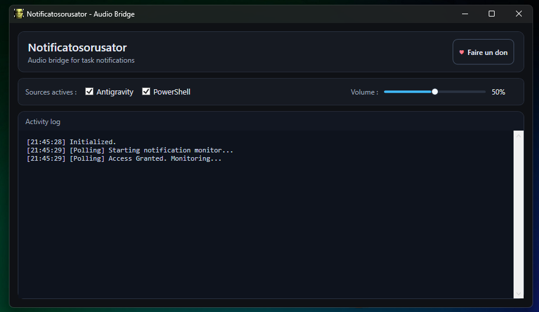

# NOTIFICATOSORUSATOR 🦖🔊

  

**Le lien manquant entre ton agent IA et le monde physique.**



---

## 🎯 Le Problème
Vos notifications Windows sont parfois silencieuses ou peu fiables.

Avec **Antigravity** / agents IA, ajoutez cette règle :
```markdown
# NOTIFICATIONS

**Toute tâche terminée (partielle ou complète) -> `notify_user` obligatoire.**
Aucune tâche ne peut se terminer sans appeler notify_user.
```

---

## ⚙️ Réglages Antigravity
Ajoutez ces lignes dans votre `settings.json` :
```json
  "antigravity.agent.notifications.desktop": "always",
  "antigravity.agent.notifications.sound": true,
  "antigravity.agent.notifyOnTaskCompletion": true,
  "antigravity.agent.notifyOnUserActionRequired": true,
  "java.showBuildStatusOnStart.enabled": "notification"
```

---

## 💡 La Solution
**Notificatosorusator** est un pont audio Windows (WPF/.NET 7) qui écoute les toasts Windows et joue des sons selon leur contenu.

### Fonctionnalités
- Écoute automatique des notifications Windows (`UserNotificationListener`)
- Règles audio:
  - contient `command` ou `run` -> `3.mp3`
  - sinon -> `1.mp3`
- Interface sombre avec sélection des sources actives + volume

---

## 🛠️ Installation et Utilisation
1. Prérequis : Windows 10/11, Mode développeur activé
2. Exécuter `REGISTER_APP.ps1` pour enregistrer l'identité app
3. Lancer `Notificatosorusator.exe` depuis `./bin/Debug/net7.0-windows10.0.19041.0/`
4. Autoriser l'accès notifications si demandé

---

## 🎵 Personnalisation
Remplacez les fichiers dans `Sounds/` :
- `1.mp3` : succès / défaut
- `3.mp3` : tâche longue

---

## 🔔 Addons IA (Global)

### Fichiers source (repo)

| Fichier | Rôle | Déployé vers |
|---------|------|-------------|
| `addons/notifications/notify.claude.ps1` | Base Claude — toast + beep, title "Claude Code", XML-escaped | `~/.claude/notify.ps1` |
| `addons/notifications/notify.ps1` | Base Codex — même logique, title "Codex" | `~/.codex/tools/notifications/notify.ps1` |
| `addons/notifications/notify.codex.ps1` | Wrapper Codex — parse payload JSON (argv / stdin / env), appelle notify.ps1 | `~/.codex/tools/notifications/codex-notify.ps1` |

### Déploiement Claude (`~/.claude/`)

Copier `notify.claude.ps1` -> `~/.claude/notify.ps1`.

Hooks requis dans `~/.claude/settings.json` :
```json
"hooks": {
  "Stop":              [{ "hooks": [{ "type": "command", "command": "powershell.exe -ExecutionPolicy Bypass -File \"C:\\Users\\<USER>\\.claude\\notify.ps1\"", "timeout": 15 }] }],
  "Notification":      [{ "hooks": [{ "type": "command", "command": "powershell.exe -ExecutionPolicy Bypass -File \"C:\\Users\\<USER>\\.claude\\notify.ps1\"", "timeout": 15 }] }],
  "PermissionRequest": [{ "hooks": [{ "type": "command", "command": "powershell.exe -ExecutionPolicy Bypass -File \"C:\\Users\\<USER>\\.claude\\notify.ps1\"", "timeout": 15 }] }]
}
```

### Déploiement Codex (`~/.codex/`)

Copier `notify.ps1` -> `~/.codex/tools/notifications/notify.ps1`
Copier `notify.codex.ps1` -> `~/.codex/tools/notifications/codex-notify.ps1`

Config requise dans `~/.codex/config.toml` :
```toml
notify = ["powershell", "-NoProfile", "-ExecutionPolicy", "Bypass", "-File", "C:\\Users\\<USER>\\.codex\\tools\\notifications\\codex-notify.ps1"]

[tui]
notification_method = "bel"
notifications = ["task_started", "task_complete", "turn_aborted"]
```

### Mapping événements -> Event param

| Événement runtime | `-Event` passé à notify.ps1 |
|-------------------|-----------------------------|
| `task_started` / `task_complete` / `turn_aborted` | `Stop` |

### Limites Codex
- La notification sur demande de commande (approval) n'est pas supportée — événement non exposé au hook `notify` dans le runtime VS Code. Cette feature fonctionne uniquement avec Claude (hook `PermissionRequest`).
- Sans `notify = [...]` dans `config.toml`, Codex ne lance aucun script externe.

## 📜 License
Ce projet est distribué sous licence AGPL-3.0.

---
*Codé 100% par des IA, supervisé à l'arrache par Obat 😏*


